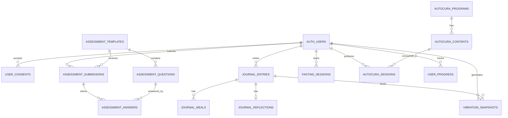

# DER do Frontend (FlutterFlow) - Reconexao Essencial

## Objetivo
Este documento traduz o frontend atual em um modelo relacional para o backend.
Foco: tabelas, PK, FK e relacoes para acelerar os requests da API (`/api/v1/auth`, `/api/v1/autocura`, diario, leitura e evolucao).

## Fontes do frontend usadas no mapeamento
- `lib/login_tela/login_tela_widget.dart`
- `lib/pages/home_page/home_page_widget.dart`
- `lib/leituradotemplo/leituradotemplo_widget.dart`
- `lib/leituradaalma/leituradaalma_widget.dart`
- `lib/diario/diario_widget.dart`
- `lib/bussoladaalma/bussoladaalma_widget.dart`
- `lib/autocura/autocura_widget.dart`
- `lib/portalautocura/portalautocura_widget.dart`
- `lib/portalautocuraaudio/portalautocuraaudio_widget.dart`
- `lib/evolucao/evolucao_widget.dart`

---

## DER (Mermaid)

---

## Dicionario de tabelas

### 1) `auth_users`
Base de usuario autenticado (sincronizada com Firebase Auth).

| Coluna | Tipo | Regra |
|---|---|---|
| `id` | UUID | PK |
| `firebase_uid` | VARCHAR(128) | UNIQUE, NOT NULL |
| `email` | VARCHAR(255) | UNIQUE |
| `display_name` | VARCHAR(120) | NULL |
| `photo_url` | TEXT | NULL |
| `phone_number` | VARCHAR(30) | NULL |
| `email_verified` | BOOLEAN | DEFAULT FALSE |
| `created_at` | TIMESTAMPTZ | NOT NULL |
| `updated_at` | TIMESTAMPTZ | NOT NULL |
| `last_login_at` | TIMESTAMPTZ | NULL |

### 2) `user_consents`
Persistencia do aceite de termos/politica (tela Home).

| Coluna | Tipo | Regra |
|---|---|---|
| `id` | UUID | PK |
| `user_id` | UUID | FK -> `auth_users.id`, NOT NULL |
| `consent_type` | VARCHAR(50) | NOT NULL (`terms_privacy`, etc.) |
| `consent_version` | VARCHAR(30) | NOT NULL |
| `accepted` | BOOLEAN | NOT NULL |
| `accepted_at` | TIMESTAMPTZ | NOT NULL |

Restricao recomendada:
- UNIQUE (`user_id`, `consent_type`, `consent_version`)

### 3) `assessment_templates`
Questionarios de leitura (templo/alma).

| Coluna | Tipo | Regra |
|---|---|---|
| `id` | UUID | PK |
| `slug` | VARCHAR(60) | UNIQUE, NOT NULL (`leituradotemplo`, `leituradaalma`) |
| `title` | VARCHAR(120) | NOT NULL |
| `description` | TEXT | NULL |
| `category` | VARCHAR(50) | NULL |
| `is_active` | BOOLEAN | DEFAULT TRUE |
| `created_at` | TIMESTAMPTZ | NOT NULL |

### 4) `assessment_questions`
Banco de perguntas de cada template.

| Coluna | Tipo | Regra |
|---|---|---|
| `id` | UUID | PK |
| `template_id` | UUID | FK -> `assessment_templates.id`, NOT NULL |
| `code` | VARCHAR(80) | NOT NULL |
| `question_text` | TEXT | NOT NULL |
| `question_type` | VARCHAR(20) | NOT NULL (`boolean`, `scale`, `text`) |
| `sort_order` | INT | NOT NULL |
| `is_required` | BOOLEAN | DEFAULT TRUE |
| `weight` | NUMERIC(5,2) | DEFAULT 1 |

Restricao recomendada:
- UNIQUE (`template_id`, `code`)

### 5) `assessment_submissions`
Cada envio de respostas de um usuario para um template.

| Coluna | Tipo | Regra |
|---|---|---|
| `id` | UUID | PK |
| `user_id` | UUID | FK -> `auth_users.id`, NOT NULL |
| `template_id` | UUID | FK -> `assessment_templates.id`, NOT NULL |
| `started_at` | TIMESTAMPTZ | NULL |
| `submitted_at` | TIMESTAMPTZ | NOT NULL |
| `score` | NUMERIC(8,2) | NULL |
| `result_level` | VARCHAR(40) | NULL |
| `result_json` | JSONB | NULL |

### 6) `assessment_answers`
Resposta por pergunta dentro de um envio.

| Coluna | Tipo | Regra |
|---|---|---|
| `id` | UUID | PK |
| `submission_id` | UUID | FK -> `assessment_submissions.id`, NOT NULL |
| `question_id` | UUID | FK -> `assessment_questions.id`, NOT NULL |
| `bool_value` | BOOLEAN | NULL |
| `numeric_value` | NUMERIC(8,2) | NULL |
| `text_value` | TEXT | NULL |
| `created_at` | TIMESTAMPTZ | NOT NULL |

Restricao recomendada:
- UNIQUE (`submission_id`, `question_id`)

### 7) `journal_entries`
Cabecalho do diario por dia (energia/presenca/agua/jejum).

| Coluna | Tipo | Regra |
|---|---|---|
| `id` | UUID | PK |
| `user_id` | UUID | FK -> `auth_users.id`, NOT NULL |
| `entry_date` | DATE | NOT NULL |
| `energy_level` | NUMERIC(4,2) | NULL (slider 0-10) |
| `presence_level` | NUMERIC(4,2) | NULL (slider 0-10) |
| `water_intake_label` | VARCHAR(40) | NULL (dropdown agua) |
| `fasting_window_label` | VARCHAR(40) | NULL (dropdown jejum) |
| `created_at` | TIMESTAMPTZ | NOT NULL |
| `updated_at` | TIMESTAMPTZ | NOT NULL |

Restricao recomendada:
- UNIQUE (`user_id`, `entry_date`)

### 8) `journal_meals`
Textos das refeicoes do diario.

| Coluna | Tipo | Regra |
|---|---|---|
| `id` | UUID | PK |
| `journal_entry_id` | UUID | FK -> `journal_entries.id`, NOT NULL |
| `meal_type` | VARCHAR(30) | NOT NULL (`desjejum`, `almoco`, `jantar`, `lanches`) |
| `description` | TEXT | NULL |
| `created_at` | TIMESTAMPTZ | NOT NULL |

Restricao recomendada:
- UNIQUE (`journal_entry_id`, `meal_type`)

### 9) `journal_reflections`
Campos textuais finais do diario.

| Coluna | Tipo | Regra |
|---|---|---|
| `id` | UUID | PK |
| `journal_entry_id` | UUID | FK -> `journal_entries.id`, UNIQUE, NOT NULL |
| `emanacoes_alma_text` | TEXT | NULL |
| `sincronicidades_text` | TEXT | NULL |
| `created_at` | TIMESTAMPTZ | NOT NULL |
| `updated_at` | TIMESTAMPTZ | NOT NULL |

### 10) `fasting_sessions`
Fluxo da Bussola da Alma (janela de jejum iniciada).

| Coluna | Tipo | Regra |
|---|---|---|
| `id` | UUID | PK |
| `user_id` | UUID | FK -> `auth_users.id`, NOT NULL |
| `selected_window_label` | VARCHAR(20) | NOT NULL (`12h`, `14h`, `16h`, `18h`, `24h`) |
| `selected_window_hours` | INT | NOT NULL |
| `started_at` | TIMESTAMPTZ | NOT NULL |
| `ended_at` | TIMESTAMPTZ | NULL |
| `status` | VARCHAR(20) | NOT NULL (`active`, `completed`, `interrupted`) |
| `source` | VARCHAR(40) | DEFAULT `bussoladaalma` |

### 11) `autocura_programs`
Programas/portais de autocura.

| Coluna | Tipo | Regra |
|---|---|---|
| `id` | UUID | PK |
| `slug` | VARCHAR(80) | UNIQUE, NOT NULL |
| `title` | VARCHAR(150) | NOT NULL |
| `description` | TEXT | NULL |
| `is_active` | BOOLEAN | DEFAULT TRUE |
| `created_at` | TIMESTAMPTZ | NOT NULL |

### 12) `autocura_contents`
Conteudo dentro dos programas (audio/texto/ritual/video).

| Coluna | Tipo | Regra |
|---|---|---|
| `id` | UUID | PK |
| `program_id` | UUID | FK -> `autocura_programs.id`, NOT NULL |
| `content_type` | VARCHAR(30) | NOT NULL (`audio`, `ritual_text`, `video`) |
| `title` | VARCHAR(160) | NOT NULL |
| `body_text` | TEXT | NULL |
| `media_url` | TEXT | NULL |
| `duration_seconds` | INT | NULL |
| `sort_order` | INT | DEFAULT 0 |
| `is_active` | BOOLEAN | DEFAULT TRUE |

### 13) `autocura_sessions`
Execucao do ritual pelo usuario (abrir portal/interromper ritual).

| Coluna | Tipo | Regra |
|---|---|---|
| `id` | UUID | PK |
| `user_id` | UUID | FK -> `auth_users.id`, NOT NULL |
| `content_id` | UUID | FK -> `autocura_contents.id`, NOT NULL |
| `started_at` | TIMESTAMPTZ | NOT NULL |
| `ended_at` | TIMESTAMPTZ | NULL |
| `completed` | BOOLEAN | DEFAULT FALSE |
| `interruption_reason` | VARCHAR(80) | NULL |

### 14) `user_progress`
Progresso por modulo/tela de jornada.

| Coluna | Tipo | Regra |
|---|---|---|
| `id` | UUID | PK |
| `user_id` | UUID | FK -> `auth_users.id`, NOT NULL |
| `module_slug` | VARCHAR(80) | NOT NULL (`autocura`, `diario`, `leituradotemplo`, etc.) |
| `status` | VARCHAR(20) | NOT NULL (`locked`, `in_progress`, `done`) |
| `progress_percent` | NUMERIC(5,2) | DEFAULT 0 |
| `last_seen_at` | TIMESTAMPTZ | NULL |
| `updated_at` | TIMESTAMPTZ | NOT NULL |

Restricao recomendada:
- UNIQUE (`user_id`, `module_slug`)

### 15) `vibration_snapshots`
Dados para a tela de evolucao (serie historica).

| Coluna | Tipo | Regra |
|---|---|---|
| `id` | UUID | PK |
| `user_id` | UUID | FK -> `auth_users.id`, NOT NULL |
| `snapshot_date` | DATE | NOT NULL |
| `energia` | NUMERIC(4,2) | NULL |
| `presenca` | NUMERIC(4,2) | NULL |
| `vibracao_media` | NUMERIC(4,2) | NULL |
| `source_entry_id` | UUID | FK -> `journal_entries.id`, NULL |
| `created_at` | TIMESTAMPTZ | NOT NULL |

Restricao recomendada:
- UNIQUE (`user_id`, `snapshot_date`)

---

## Mapa de relacoes (PK/FK)
- `user_consents.user_id` -> `auth_users.id`
- `assessment_questions.template_id` -> `assessment_templates.id`
- `assessment_submissions.user_id` -> `auth_users.id`
- `assessment_submissions.template_id` -> `assessment_templates.id`
- `assessment_answers.submission_id` -> `assessment_submissions.id`
- `assessment_answers.question_id` -> `assessment_questions.id`
- `journal_entries.user_id` -> `auth_users.id`
- `journal_meals.journal_entry_id` -> `journal_entries.id`
- `journal_reflections.journal_entry_id` -> `journal_entries.id`
- `fasting_sessions.user_id` -> `auth_users.id`
- `autocura_contents.program_id` -> `autocura_programs.id`
- `autocura_sessions.user_id` -> `auth_users.id`
- `autocura_sessions.content_id` -> `autocura_contents.id`
- `user_progress.user_id` -> `auth_users.id`
- `vibration_snapshots.user_id` -> `auth_users.id`
- `vibration_snapshots.source_entry_id` -> `journal_entries.id`

---

## Mapeamento endpoint -> tabelas

### `/api/v1/auth`
- `POST /api/v1/auth/sync-user` -> `auth_users`
- `GET /api/v1/auth/me` -> `auth_users`
- `POST /api/v1/auth/consents` -> `user_consents`

### `/api/v1/autocura`
- `GET /api/v1/autocura/programs` -> `autocura_programs`
- `GET /api/v1/autocura/programs/{slug}/contents` -> `autocura_programs`, `autocura_contents`
- `POST /api/v1/autocura/sessions/start` -> `autocura_sessions`
- `PATCH /api/v1/autocura/sessions/{id}/finish` -> `autocura_sessions`
- `GET /api/v1/autocura/sessions/history` -> `autocura_sessions`, `autocura_contents`

### (complementares para o frontend atual)
- `GET /api/v1/assessments/templates` -> `assessment_templates`
- `GET /api/v1/assessments/templates/{slug}` -> `assessment_templates`, `assessment_questions`
- `POST /api/v1/assessments/submissions` -> `assessment_submissions`, `assessment_answers`
- `GET /api/v1/journal/entries?date=YYYY-MM-DD` -> `journal_entries`, `journal_meals`, `journal_reflections`
- `POST /api/v1/journal/entries` -> `journal_entries`, `journal_meals`, `journal_reflections`
- `POST /api/v1/fasting/sessions/start` -> `fasting_sessions`
- `PATCH /api/v1/fasting/sessions/{id}/finish` -> `fasting_sessions`
- `GET /api/v1/evolucao/series` -> `vibration_snapshots` (ou calculo a partir de `journal_entries`)

---

## Ordem recomendada de implementacao (backend)
1. Criar `auth_users`, `user_consents`.
2. Criar bloco de leitura (`assessment_templates`, `assessment_questions`, `assessment_submissions`, `assessment_answers`).
3. Criar bloco do diario (`journal_entries`, `journal_meals`, `journal_reflections`).
4. Criar `fasting_sessions`.
5. Criar bloco autocura (`autocura_programs`, `autocura_contents`, `autocura_sessions`).
6. Criar `user_progress` e `vibration_snapshots` para evolucao.

Este modelo foi desenhado para refletir o frontend atual sem acoplar o banco a detalhes de widget.
